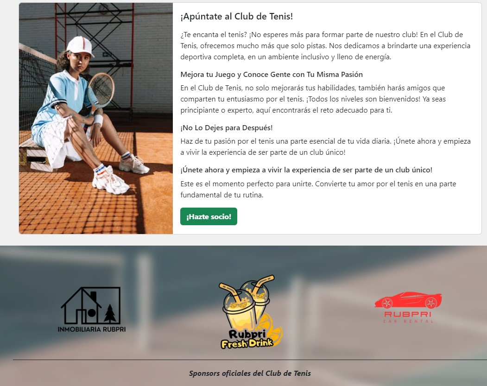
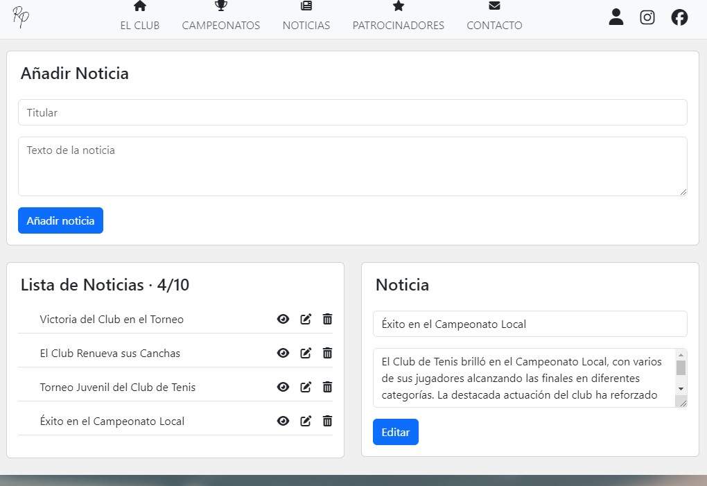
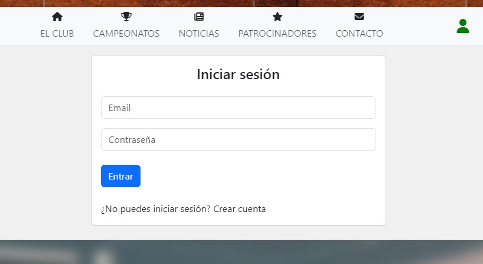

# Club de Tenis

Página web de un Club de Tenis.

## Stack Tecnológico

+ HTML5, CSS3, Bootstrap, JavaScript, TypeScript
+ Angular (18.0.5)
+ Firebase (Firestore, Authentication)

*Se ha usado ngx-env para las variables de entorno (.env)*

## Enlaces

Link al Live: <a href="https://tennis-club-rubpri.vercel.app/" target="_blank">https://tennis-club-rubpri.vercel.app/</a>

## Imágenes de la App

## Perfiles

